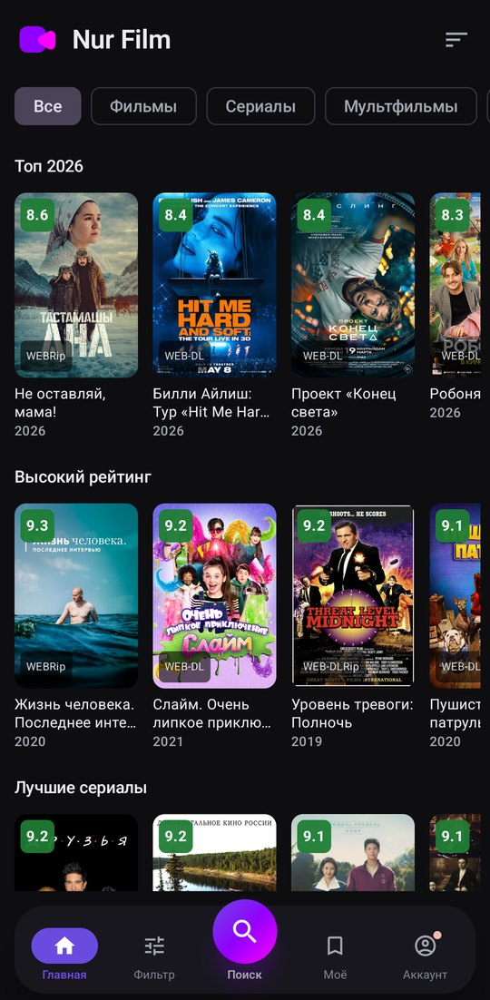
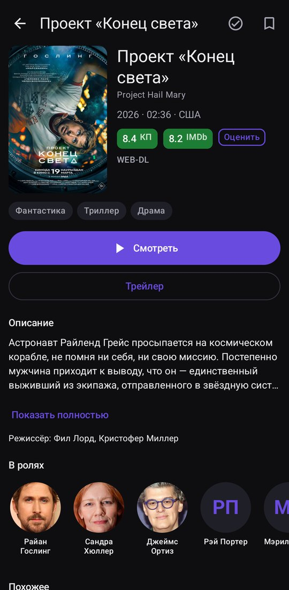
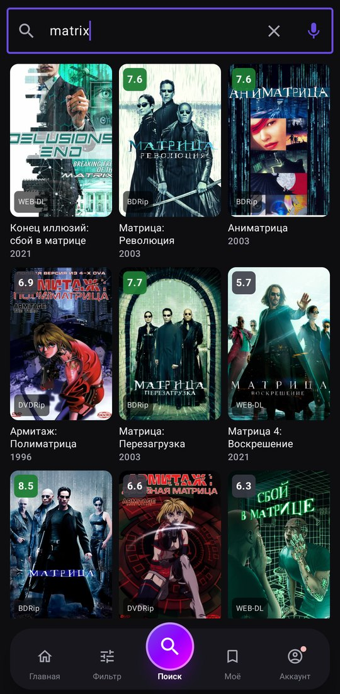
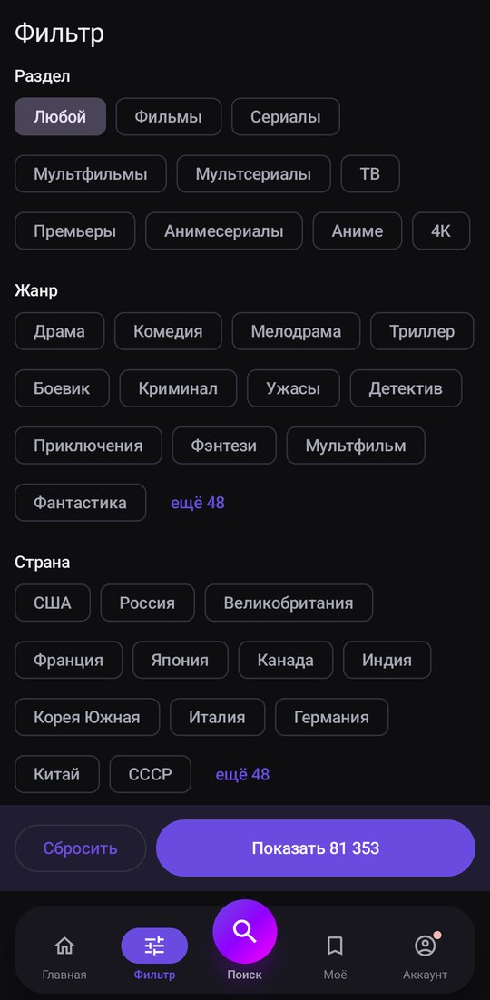
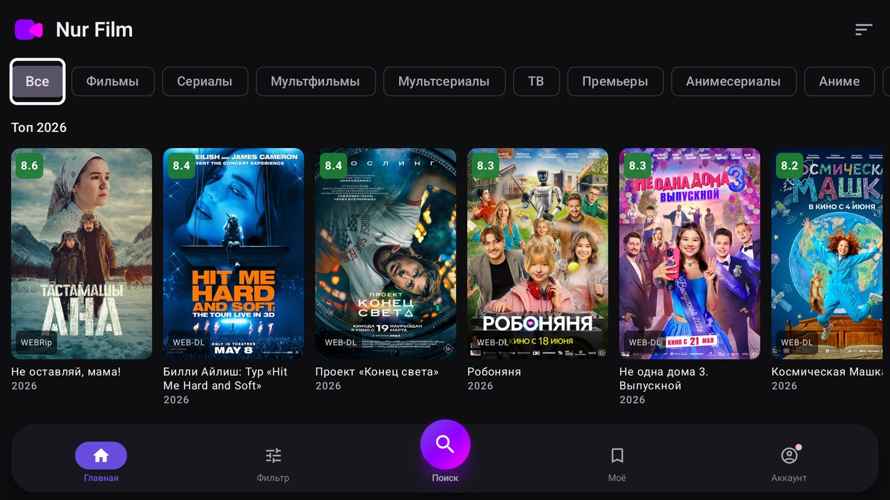

<p align="center">
  
</p>

<p align="center">
  <b>Фильмы, сериалы, мультфильмы и аниме на Android и Android TV</b>
</p>

<p align="center">
  <a href="https://github.com/Nurullaev/NurFilm/releases/latest"></a>
  
  
</p>

---

**Nur Film** — бесплатный онлайн-кинотеатр в приложении. Больше 80 000 фильмов, сериалов, мультфильмов и аниме, у многих — несколько озвучек на выбор. Без подписок, без покупок внутри, VPN не нужен.

## Скачать

| | |
|---|---|
| **Последняя версия** | [nurfilm-latest.apk](https://nurfilm.app/app/nurfilm-latest.apk) — постоянная ссылка, всегда свежая версия |
| **Короткая ссылка** | **`nurfilm.app/tv`** или **`nurfilm.app/apk`** — тот же файл, удобно набрать пультом или продиктовать |
| **GitHub Releases** | [последний релиз](https://github.com/Nurullaev/NurFilm/releases/latest) — файл и контрольная сумма SHA-256 |

Требуется Android 8.0 или новее, размер — около 13 МБ. Приложение обновляется само: установить файл нужно один раз.

## Скриншоты

<p align="center">
  
  
  
  
</p>

<p align="center">
  
</p>

## Возможности

- **Каталог** — подборки «Топ», «Высокий рейтинг», «Лучшие сериалы», «В 4K», разделы и сортировка по новизне, рейтингу и году
- **Поиск** — по названию на русском и английском, в том числе **голосом**
- **Фильтр** — жанр, страна, озвучка, годы, рейтинг Кинопоиска
- **Страница фильма** — рейтинги КП и IMDb, актёры с фотографиями и всей их фильмографией, трейлер, похожие фильмы
- **Выбор озвучки** перед просмотром
- **Моё** — «Продолжить просмотр», избранное, история и отметки «Просмотрено»
- **Своя оценка** от 1 до 10 рядом с КП и IMDb
- **Синхронизация между устройствами** после входа через Telegram — происходит сама, в течение полуминуты
- **Android TV и Google TV** — управление пультом
- **Обновления внутри приложения** со списком изменений

## Установка

### На телефон

1. Откройте на телефоне **`nurfilm.app/apk`** — файл начнёт скачиваться.
2. Откройте скачанный файл. Android попросит разрешить установку из этого источника — разрешите.
3. Нажмите «Установить».

Предупреждение Android — стандартное для любого приложения не из Google Play.

### На телевизор с Android TV / Google TV

- **Без флешки:** установите на телевизор из Google Play приложение Downloader и введите в нём **`nurfilm.app/tv`** — файл скачается и сразу предложит установку. Если на телевизоре есть браузер, можно набрать тот же адрес в нём.
- **С флешки:** скачайте файл по ссылке `nurfilm.app/tv`, скопируйте на флешку, вставьте её в телевизор и откройте через файловый менеджер.

После установки Nur Film появится в списке приложений телевизора. На телевизоры Samsung (Tizen) и LG (webOS) приложение не ставится — у них не Android.

## Вход через Telegram

Вход необязательный. Без него всё работает, но история, избранное и оценки хранятся только на этом устройстве.
После входа через бота [@NurFilm_robot](https://t.me/NurFilm_robot) они одинаковые на всех ваших устройствах и переживают переустановку. Пароль и номер телефона приложение не получает.

## Конфиденциальность

- Без входа отправляется только обезличенная статистика: случайный номер установки, версия приложения и Android, модель устройства, язык, страна и часовой пояс из настроек, число запусков и включений плеера, отчёты о сбоях. **Что вы смотрите, не передаётся.**
- После входа хранятся Telegram ID, имя и username, а также история, избранное, отметки и оценки — ради синхронизации.
- Разрешения: интернет, установка собственных обновлений, уведомления.

## Проверка файла

Каждый релиз подписан одним и тем же ключом — обновление встаёт поверх прежней версии без потери данных. Контрольная сумма SHA-256 указана в описании каждого [релиза](https://github.com/Nurullaev/NurFilm/releases):

```bash
shasum -a 256 nurfilm-1.26.apk
```

## История изменений

Полный список — в [CHANGELOG.md](CHANGELOG.md).

---

<sub>В этом репозитории публикуются релизы и история изменений. Исходный код приложения закрыт. © 2026 Nur Film</sub>
